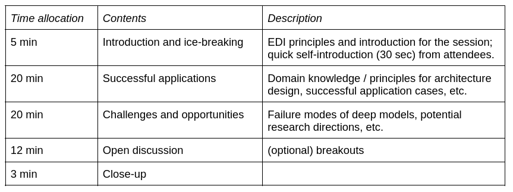

### 2022 ICML WiML [Un-workshop](https://sites.google.com/wimlworkshop.org/wiml-unworkshop2022/) Breakout: Machine Learning for Physical Sciences

#### Objectives

#### Agenda
[*Zoom Meeting Room*](https://umontreal.zoom.us/j/87026523803?pwd=N2xDVUpyanRIVTNsbThnY0QyTmdMUT09)

#### Topics
* Successful applications: domain-specific architectures, generative modelling, etc. 
* Challenges and opportunities: when do deep models fail? What are the obstacles in the workflow? 
* As women researchers, what obstacles did you face? What support would you like to have in order to advance your careers?

#### Community Development

* Join [WiML-ML4PS Google Group](https://groups.google.com/g/wiml-ml4ps)

#### References

* Carleo, Giuseppe, et al. "Machine learning and the physical sciences." Reviews of Modern Physics 91.4 (2019): 045002.
* https://github.com/taolicheng/DL4Physics

#### Code of Conduct
* EDI (Equity, Diversity, and Inclusion) Principles:
* 
